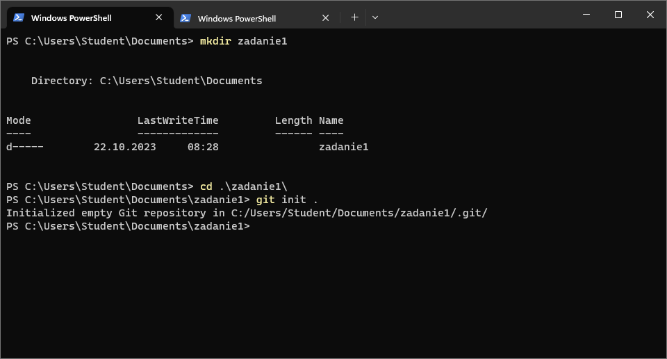
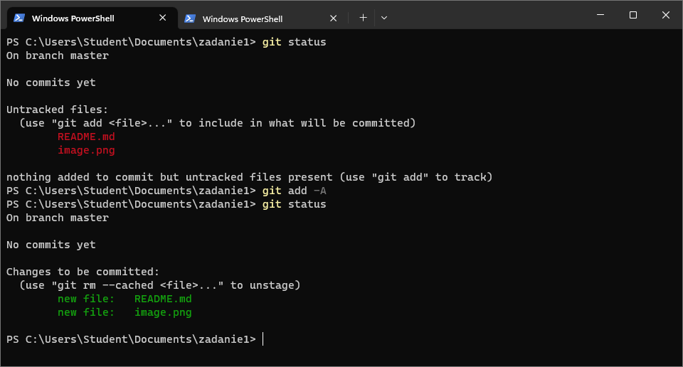
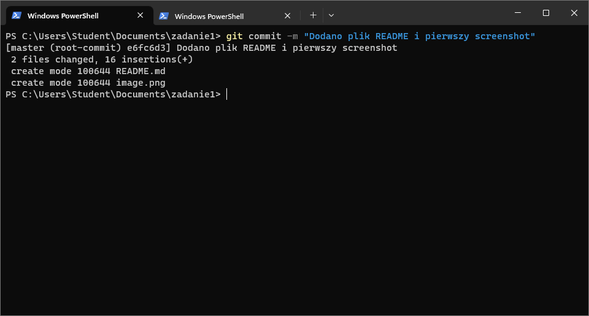

# Sprawozdanie zadanie 1

1. Zainicjuj nowe repozytorium Git w dowolnym folderze na swoim komputerze, używając komendy:
`git init`
2. Utwórz nowy plik tekstowy o nazwie `"moj_plik.txt"` wewnątrz tego repozytorium i dodaj kilka przykładowych linii tekstu do tego pliku.
3. Użyj komendy git status, aby sprawdzić stan repozytorium. Zobaczysz, że plik `"moj_plik.txt"` jest nierozpoznany przez Git.
4. Dodaj plik `"moj_plik.txt"` do indeksu przy użyciu komendy git add:
git add `"moj_plik.txt"`
5. Ponownie użyj git status, aby zobaczyć, że plik został dodany do indeksu.
6. Teraz wykonaj commit, aby zatwierdzić zmiany w indeksie. Użyj komendy git commit z odpowiednim komunikatem:
git commit -m `"Dodano moj_plik.txt"`
7. Plik `"moj_plik.txt"` jest teraz śledzony w repozytorium i ma zatwierdzony stan.
8. Możesz również utworzyć zdalne repozytorium (na platformie takiej jak GitHub lub GitLab) i udostępnić je innym osobom, aby pokazać, jak można współpracować nad projektem i udostępniać zmiany.

## Screenshots

